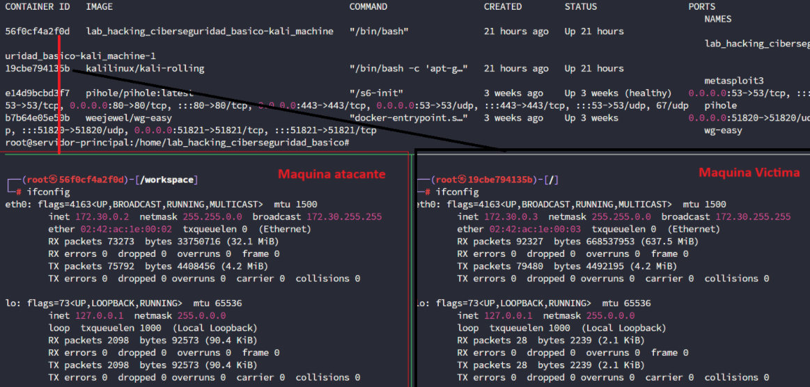
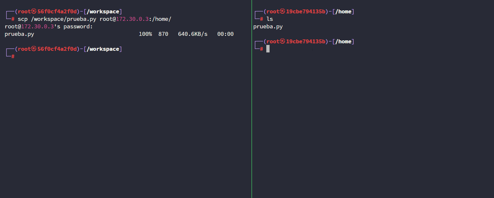
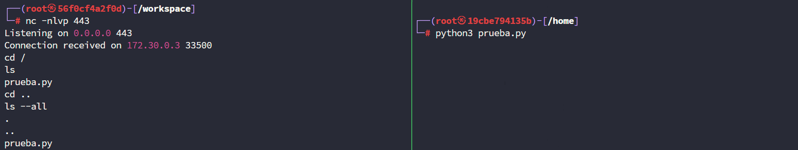
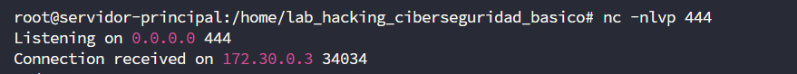
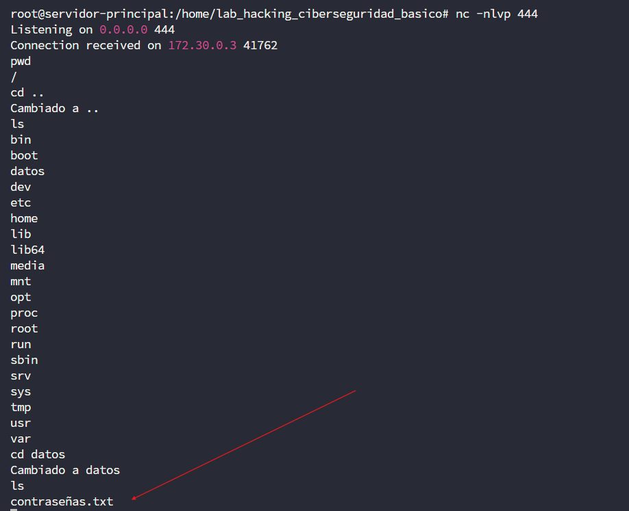
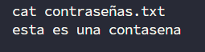
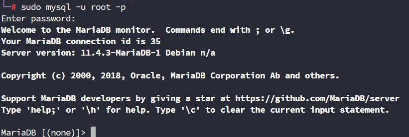
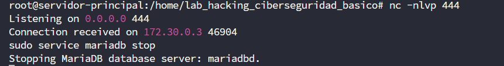

# 📄 Informe de Laboratorio de Hacking Ético  
**Diplomado de Ciberseguridad - Emulación de Ataque de Conexión Remota**


## 🧪 Introducción

En el marco del diplomado de ciberseguridad, se realizó un laboratorio práctico de **Ciberseguridad Basico** enfocado en la **emulación de un ataque de acceso remoto**. El objetivo principal fue demostrar cómo un atacante puede establecer una conexión remota con una máquina víctima mediante ingeniería social y técnicas de evasión de antivirus.

---

## 🖥️ Entorno del Laboratorio

Se utilizaron dos máquinas virtuales conectadas en red local para simular el entorno víctima-atacante:



---

## 📦 Envío del Archivo Malicioso

El primer paso consistió en enviar un archivo malicioso desde la máquina atacante hacia la víctima, simulando un ataque por **phishing**.



Se utilizó el protocolo **SSH** para el envío inicial, con el fin de probar la ejecución del script y validar que la conexión remota funcionara correctamente.



Una vez ejecutado el script en la máquina víctima, se comprobó que el atacante podía conectarse y ejecutar comandos en la terminal remota.

---

## 🧬 Escalando el Ataque: Ofuscación y Distribución

### 1. Ofuscación del Código

Para evadir mecanismos de detección por antivirus, se procedió a **ofuscar el código fuente original** (`code_no_ofuscacion.py`), utilizando técnicas de ofuscación y renombramiento de variables, generando así `code_ofuscacion.py`.

### 2. Conversión a .EXE

Se compiló el código en un ejecutable `.exe` mediante `PyInstaller`:

```bash
cd ruta\a\tu\carpeta
pyinstaller --onefile code_ofuscacion.py
```

### 3. Inserción en un Documento PDF

Utilizando la herramienta **SET (Social Engineering Toolkit)**, se incrustó el ejecutable en un archivo PDF, simulando una técnica de ingeniería social para facilitar la ejecución del malware por parte de la víctima.

---

## 🔍 Acciones Realizadas tras la Conexión

### 🗂️ 1. Exploración de Datos Confidenciales

Desde la máquina atacante, se estableció una conexión remota al **puerto 444**, donde se encontraba activo el servicio inverso.



Una vez dentro del sistema, se navegaron los directorios hasta encontrar archivos con datos confidenciales.



Los contenidos fueron visualizados con comandos como `cat`.



---

### 🧬 2. Acceso a la Base de Datos

A través de la conexión remota, se obtuvo acceso a las credenciales y servicios de base de datos.



Esto permitió:

- Visualizar nombres de tablas.
- Leer e insertar registros.
- Eliminar información crítica del sistema.

---

### 🔥 3. Finalización de Servicios

Se demostraron acciones destructivas, como el **cierre de servicios esenciales del sistema**, incluyendo el motor de bases de datos.



Con ello, se evidenció la capacidad del atacante para inhabilitar componentes clave del sistema comprometido.

---

## 🧠 Conclusiones

- Este laboratorio permitió simular un ataque realista de conexión remota, comenzando con una acción de ingeniería social hasta la ejecución de comandos con privilegios.
- Se exploraron técnicas clave como la **ofuscación de código**, evasión de antivirus, manipulación de archivos PDF y explotación de servicios del sistema.
- Este ejercicio refuerza la importancia de implementar medidas preventivas como antivirus robustos, restricciones en la ejecución de archivos externos y capacitación constante al personal.

